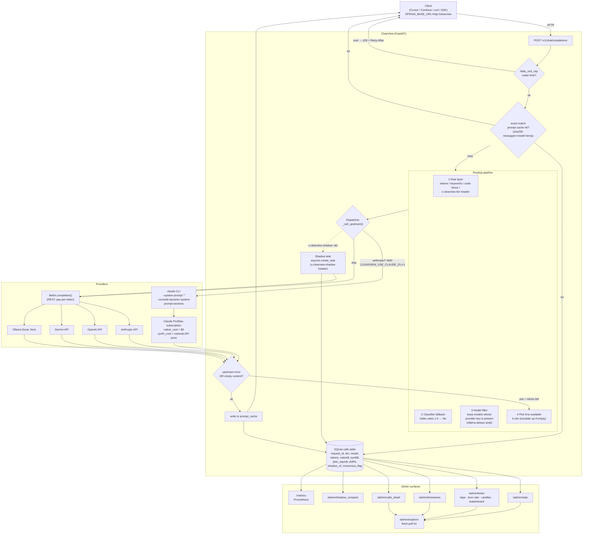
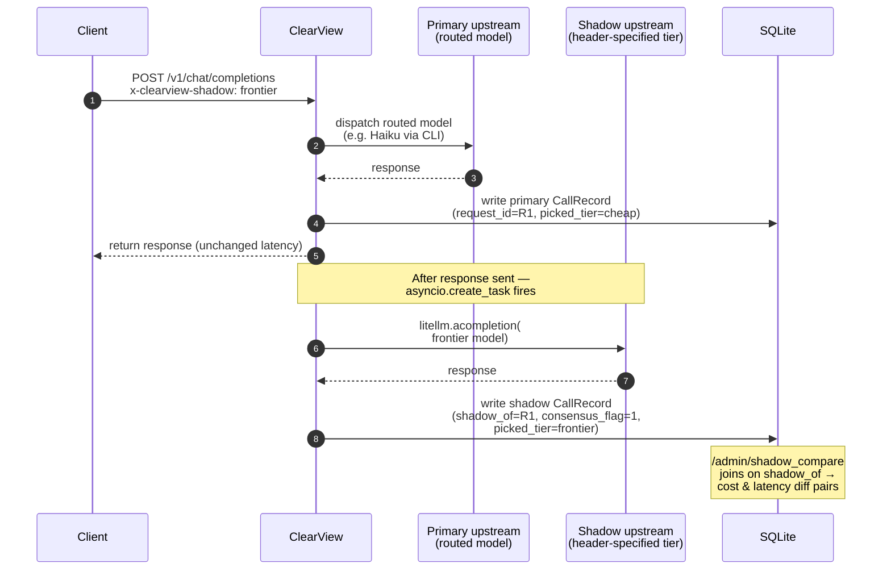
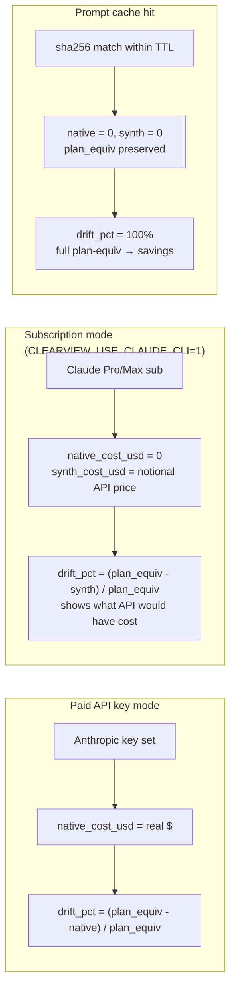
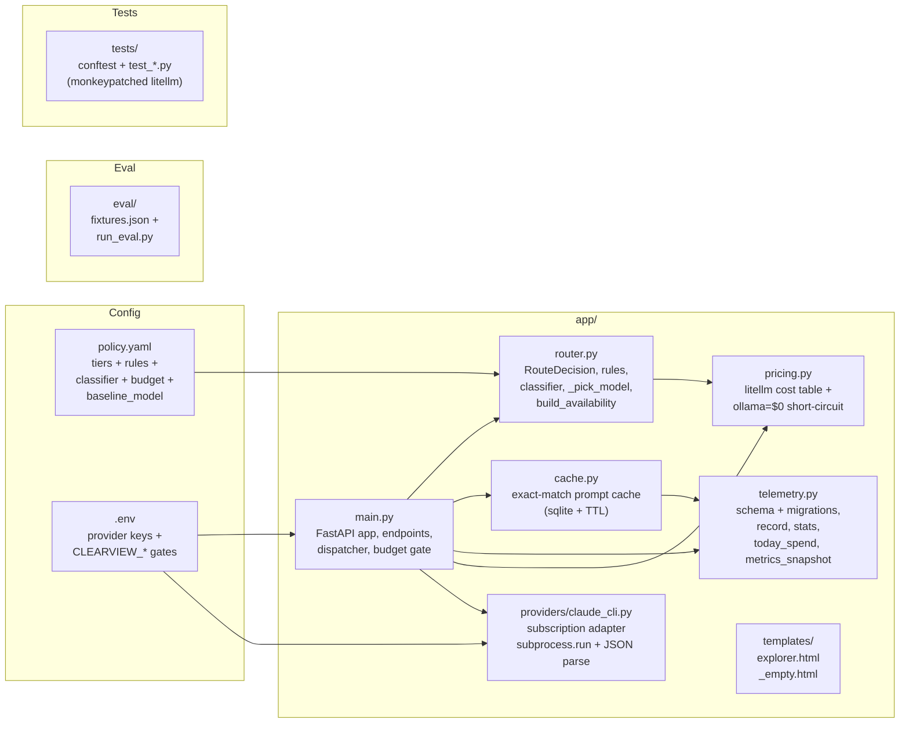

# ClearView — Architecture

## End-to-end request flow

## Shadow route (concurrent comparison)

## Cost accounting (3 modes)

## Component map

## Surface map (admin)

| Endpoint | Purpose | Used by |
|----------|---------|---------|
| `GET /v1/models` | OpenAI-compat model list (virtual + underlying) | clients |
| `POST /v1/chat/completions` | Main proxy | clients |
| `GET /health` | Liveness | infra |
| `GET /admin/stats` | Aggregate KPIs + last 200 rows | explorer |
| `GET /admin/timeseries` | Per-minute buckets for sparklines | explorer |
| `GET /admin/calls_detail` | Same rows + extra fields for modal | explorer |
| `GET /admin/ticker` | Tape, burn rate, candles, leaderboard | explorer |
| `GET /admin/shadow_compare` | Primary↔shadow pairs joined on `shadow_of` | ops |
| `GET /admin/explorer` | Server-rendered Bloomberg-style page | humans |
| `GET /metrics` | Prometheus text format | scrape |

Admin endpoints respect `CLEARVIEW_ADMIN_TOKEN` (bearer auth). `/metrics` always open per convention.
